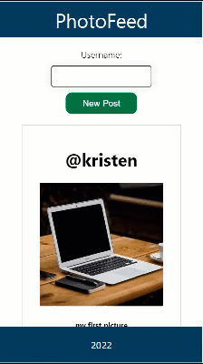
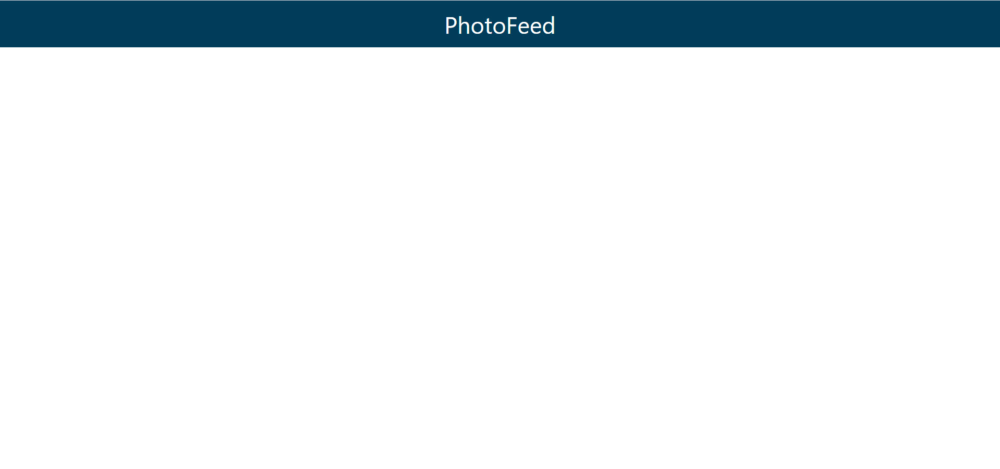
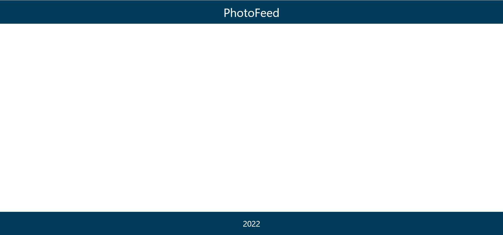

# PhotoFeed Codealong

During this code along you will use React to create a PhotoFeed app.



View the [final product](https://intro-to-react.s3.amazonaws.com/index.html)

## Getting Started

<Details>
<Summary>Start from scratch</Summary>

1. create empty react app using vite `npm create vite@latest`

2. Then follow the prompts

    - Type the project-name
    - Select React as the framework
    - Select Javascript as the variant

3. Cd into the project directory, run `npm install`, and then `npm run dev`.
4. View the app in the browser at http://localhost:5173/ 

</Details>

<Details>
<Summary>Use Starter Code</Summary>

1. Clone or download this repository into your local machine.
2. Open the `my-starter-app` folder in your favorite text editor
3. In terminal run `npm install` and `npm run dev`
4. View the app in the browser at http://localhost:5173


</Details>


## Components
Now let's start building the components for our app. In the src folder create a folder named components.

### Header
1. In the components folder add a file named Header.jsx
1. Create a react functional component called Header that accepts props and returns a div with a className of header and the `props.title` as the content
1. The HTML code must be wrapped in ONE top level element.
1. Export the Header component
1. At the top of Header.jsx import the css for the header. We will create this file in a later step.
<Details>
<Summary>Header Code</Summary>

```js

import './Header.css';

function Header(props) {

    return(
        <div className="header">
            {props.title}
        </div>
    )

}

export default Header;

```
</Details>

### Update App.jsx
1. Import the Header component into the top of App.jsx  

```js 

import Header from './components/Header';

```
1. Add the Header component to App.jsx with the title attribute value of PhotoFeed.

```js 

<Header title="PhotoFeed" />

```

1. View the app in the browser

### Header css
1. In the components folder create a file named Header.css
1. Add css to style the header class

```css

.header {
    background-color: #013D5B;
    min-height: 10vh;
    display: flex; 
    flex-direction: column;
    align-items: center;
    justify-content: center;
    font-size: 36px;
    color: white;
}

```
1. View the app in the browser



### Footer
1. In the components folder add a file named Footer.jsx
1. Add a functional component named Footer and return a div with a className of footer. 
1. Pass `props` to the Footer function
1. Add `{props.text}` as the footer content
1. Import Footer.css into Footer.jsx

<Details>
<Summary>Footer Code</Summary>

```js 

import "./Footer.css";

function Footer(props) { 
    
    return(
        <div className="footer">
            {props.text}
        </div>
    )

}

export default Footer;

```

</Details>

### Update App.jsx

1. Import the footer component in App.jsx
1. Add the Footer component in app.jsx with the text attribute value of 2022. `<Footer text="2023" />`

#### Footer css
1. In the components folder create a file named Footer.css
1. Add css to style the footer

```css

.footer {
    background-color: #013D5B;
    min-height: 10vh;
    display: flex; 
    flex-direction: column; 
    align-items: center;
    justify-content: center;
    font-size: calc(10px + 2vmin);
    color: white;
    position: fixed;
    bottom: 0;
    left:0;
    width: 100%;
}

```



### Post
1. In the components folder add a file named Post.jsx
1. At the top of Post.jsx import the css for the post. We will create this file in a later step.
1. Add a constant named IMAGE_URL with the value of `https://picsum.photos/500/500?image=`.  
1. Add a functional component named Post and return a div with a className of post. 
1. Pass `props` to the Post function.
1. Add an `h1` element with the props.username
1. Add an `img` element with the src set to `IMAGE_URL + props.imageId`
1. Add an `h5` element with the props.caption

<Details>
<Summary>Post Code</Summary>

```js

import "./Post.css";
const IMAGE_URL = 'https://picsum.photos/500/500?image=';

function Post(props) {
    return (
        <div className="post">
            <h1>@{props.username}</h1>
            
            <h5>{props.caption}</h5>
        </div>
    )
}


export default Post;

```

</Details>


### Post css
1. In the components folder create a file named Post.css
1. Add css to style the post

```css

.post {
    margin: 20px;
    padding: 20px;
    background-color: white;
    border: 1px solid lightgrey;
}

.post img {
    max-width: 90%;
}

```


The post component represents one post component but we want to be able to add multiple posts and have them display in a scrollable feed.


### Feed
1. In the components folder add a file named Feed.jsx
1. Import the Post component into Feed.jsx
1. Add a functional component named Feed and return a div with a className of feed.
1. At the top of the Feed function create a constant named postList and add sample posts

```js

    const postList = [
        {
            username: 'arelthia',
            imageId: 0,
            caption: 'my first picture'
        },
        {
            username: 'janet',
            imageId: 10,
            caption: 'my second picture'
        },
        {
            username: 'anthony',
            imageId: 20,
            caption: 'my third picture'
        }
    ];

```
1. In the `div` map through the `PostList` to display all the posts

<Details><Summary>Feed Code</Summary>

```js


import Post from './Post';

function Feed() {
    const postList = [
        {
            username: 'arelthia',
            imageId: 0,
            caption: 'my first picture'
        },
        {
            username: 'janet',
            imageId: 10,
            caption: 'my second picture'
        },
        {
            username: 'anthony',
            imageId: 20,
            caption: 'my third picture'
        }
    ];


    return (
        <div className="feed">
            {postList.map((post, k) => {
                return <Post imageId={post.imageId} username={post.username} caption={post.caption} key={k} />
            })}
        </div>
    )
}

export default Feed;


```
</Details>

1. Import the feed component in app.jsx
1. Add the feed component to app.jsx between the header and footer
1. You should now be able to scroll and see all 3 posts in the feed

#### Feed css
1. In the components folder create a file named Feed.css
1. Add css to style the feed

```css

.feed {
    margin: 0 auto; 
    padding: 20px; 
    height: 80vh; 
    overflow-y: auto;
    display: flex; 
    flex-direction: column;
    align-items: center;
}

.newPostButton {
    background-color: #008140;
    padding: 20px 32px;
    color: white; 
    border: none;
    border-radius: 12px;
    display: block;
    line-height: 0px;
    font-size: 16px;
}

label {
    font-size: 16px;
}

#usernameInput {
    box-shadow: 0 0 15px 4px rgba(0,0,0,0.06);
    border-radius: 5px;
    padding: 10px;
    margin: 10px;
}

```

1. Import Feed.css into Feed.jsx
1. View the app in the browser

If you look at the final product you you will notice we still need to add the ability to create a new post.

### Update Feed.jsx

1. At the top os Feed.jsx import useState from react
`import { useState } from 'react';` this will let us add state variables to the component
1. Under postList add a state for posts.
`const [posts, setPosts] = useState(postList);`
1. Change the the code so it maps posts instead of postList
1. View in the browser to verify that the feed still shows
1. Add a state for imageId with the initial value of 30
`const [imageId,setImageId] = useState(30);`
1. Add a state for username
`const [username,setUsername] = useState("");`
 
 #### Add ability to add post 
 1. In the div add a label element for the usernameInput.
 1. Add an input element with a class of usernameInput and and if of usernameInput with an onChange event. The onChange event should update the username state. The value of the input should be the value of the username state.
 1. Add a New Post button with a class of newPostButton and an onClick event named handleCreateNewPost.

 <Details><Summary>Feed Class Code</Summary>
    The div with the className of feed should contain the following:

```html
        
        <div className="feed">
            <label htmlFor="usernameInput">Username:</label>
            <input className="usernameInput" id="usernameInput" onChange={event => setUsername(event.target.value)} value={username}></input>
            <button className="newPostButton" onClick={handleCreateNewPost}>New Post</button>
            {posts.map((post, k) => {
                return <Post imageId={post.imageId} username={post.username} caption={post.caption} key={k} />
            })}
        </div>

```

 </Details>

#### Add event handler
1. Below the state variables and before the return define the handleCreateNewPost event handler
1. In the handleCreateNewPost eventhandler setPosts
1. Set the next imageid
1. Clear the username

<Details><Summary>Event Handler Code</Summary>
    
```js

    const handleCreateNewPost = event => {
        setPosts([{
            username: username,
            imageId: imageId,
            caption: "my caption"
        }, ...posts]);
        setImageId(imageId + 10);
        setUsername("");
    }

```
</Details>


## Challenge
1. Add an input for the user to enter a caption
1. Add the caption to the post
