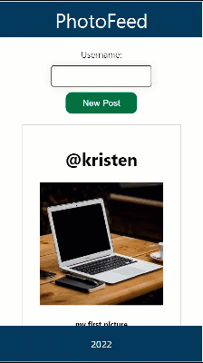
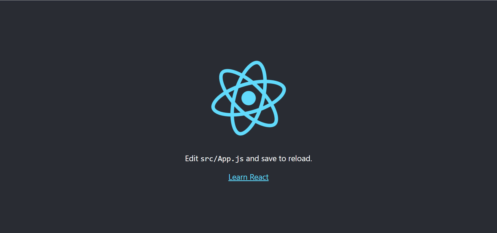
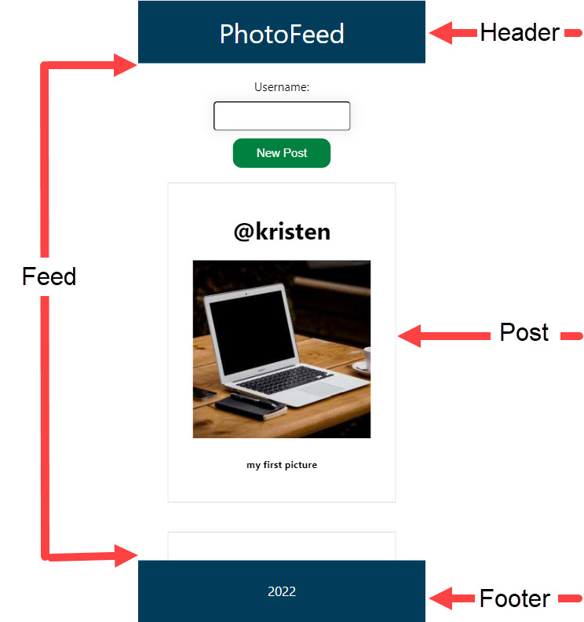
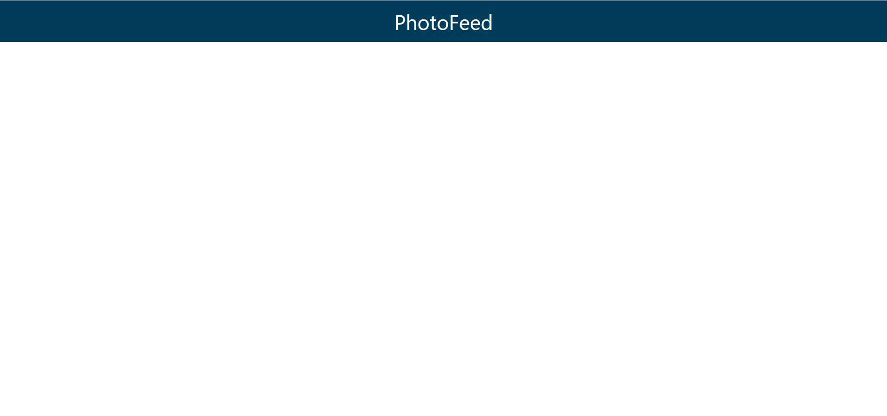
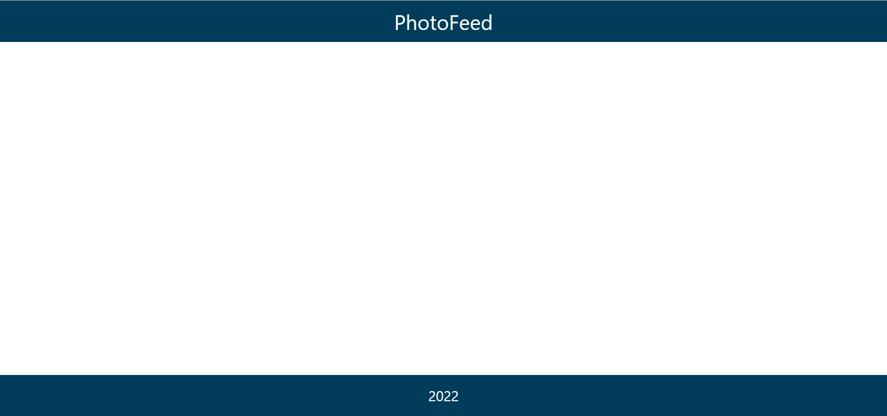
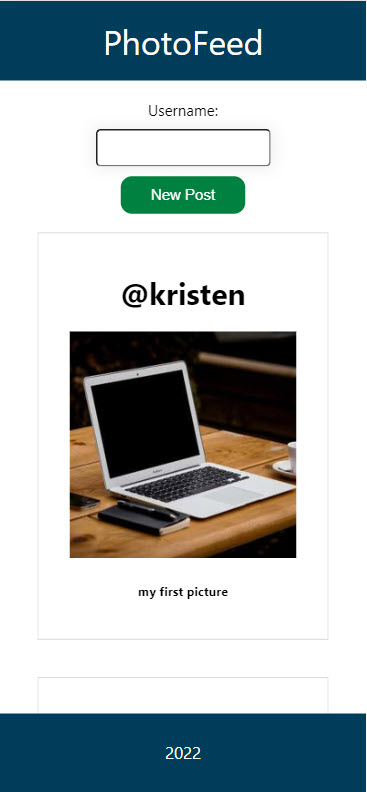

# PhotoFeed Codealong

During this code along you will use React to create a PhotoFeed app.

View the [final product](https://intro-to-react.s3.amazonaws.com/index.html)

1. create empty react app `npx create-react-app photo-feed`

2. In Terminal run `npm start`

## Getting Started
1. In browser visit http://localhost:3000/

1. Delete Anchor element, image element, and paragraph element
1. Delete the `import logo from './logo.svg';`
1. Type `PhotoFeed` between the header tags
1. View the changes in the browser

## Components

Now let's start building the components for our app. In the src folder create a folder named components.

### Header
1. In the components folder add a file named Header.js
1. The HTML code must be wrapped in ONE top level element.
1. import the Header component into app.js 
1. Add the Header component to app.js

#### Header css
1. In app.css delete all the css except for the first 3 lines.

1. In the components folder create a file named Header.css
1. Add css to style the header
1. Import Header.css into Header.js

#### Make the Header component reuseable
1. In Header.js pass in props as a paramater.footer
1. Delete the static tile and add `{props.title}`
1. In the Header tag in app.js add a title attribute `title="PhotoFeed"`. 
1. It should still look the same

### Footer
1. In the components folder add a file named Footer.js
1. Add the Footer function and return a div with a className of footer. 
1. Pass `props` to the Footer function
1. Add `{props.text}` as the footer content
1. Import the footer component in app.js
1. Add the Footer component in app.js with the text attribute value of 2022.

#### Footer css
1. In the components folder create a file named Footer.css
1. Add css to style the footer
1. Import Footer.css into Footer.js

### Post
1. In the components folder add a file named Post.js
1. Add the Post function.
1. Pass props to the Post function
1. In the post function return a div with a className of post
1. Add an `h1` element with the content 
1. Add an `img` element
1. Add an `h5` element
1. Import the Post component in app.js
1. Add the post component in app.js.

#### Post css
1. In the components folder create a file named Post.css
1. Add css to style the post
1. Import Post.css into Post.js

### Feed
1. In the components folder add a file named Feed.js
1. Add the Feed function.
1. Import the Post component
1. In the `div` map through the `PostList` to display all the posts
1. Remove the Post component from app.js 
1. Import the feed component in app.js
1. Add the feed component to app.js
1. You should now be able to scroll and see all 3 posts in the feed

#### Feed css
1. In the components folder create a file named Feed.css
1. Add css to style the feed
1. Import Feed.css into Feed.js
1. Add new posts (posts state)
1. Import react and use state
`import React, { useState } from 'react';`
1. add a state for posts.
`const [posts, setPosts] = useState(postList);`
1. Change the the code so it maps posts instead of postList
1. verify that the feed still shows
1. add a state for imageId
`const [imageId,setImageId] = useState(30);`
1. add a state for username
`const [username,setUsername] = useState("");`
 
 #### Add ability to add post 
 1. Add a label element
 1. Add an input element with an onChange event
 1. Add a button with an onClick event

#### Add event handler
1. Define the handleCreateNewPost event handler
1. In the handleCreateNewPost eventhandler setPosts
1. Set the next imageid
1. Clear the username

#### Update feed css
1. Style the label
1. Style the input
1. Style the button

## Challenge
1. Add an input for the user to enter a caption
1. Add the caption to the post
